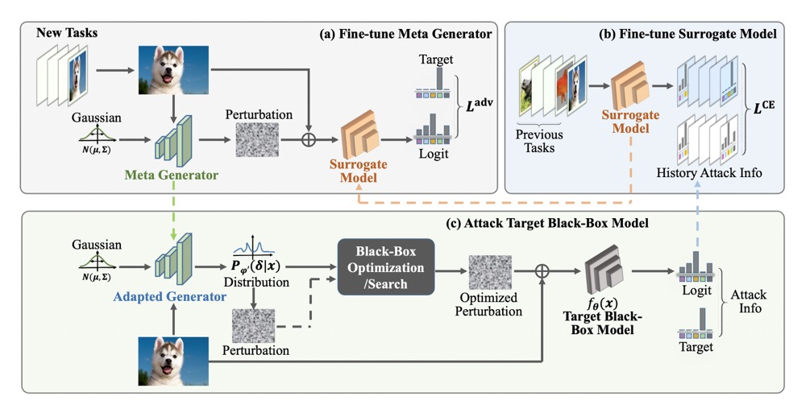

# MCG: Generalizable Black-box Adversarial Attack with Meta Learning.

<!---
## [Overview](#overview)

<a href="#top">[Back to top]</a>
-->

 

#### Abstract

In the scenario of black-box adversarial attack, the target model's parameters are unknown, 
and the attacker aims to find a successful adversarial perturbation based on query feedback under a query budget. 
Due to the limited feedback information, existing query-based black-box attack methods often require many queries for 
attacking each benign example. To reduce query cost, we propose to utilize the feedback information across historical 
attacks, dubbed example-level adversarial transferability. Specifically, by treating the attack on each benign example 
as one task, we develop a meta-learning framework by training a meta generator to produce perturbations conditioned on 
benign examples. When attacking a new benign example, the meta generator can be quickly fine-tuned based on the feedback 
information of the new task as well as a few historical attacks to produce effective perturbations. Moreover, since the 
meta-train procedure consumes many queries to learn a generalizable generator, we utilize model-level adversarial 
transferability to train the meta generator on a white-box surrogate model, then transfer it to help the attack against 
the target model. The proposed framework with the two types of adversarial transferability can be naturally combined 
with any off-the-shelf query-based attack methods to boost their performance.

#### Environment

```
advertorch==0.2.3
argparse==1.4.0
astunparse==1.6.3
pytorch==1.3.0
torchattacks==3.0.0
torchvision==0.4.1
```

#### Pre-trained Models

Please download our [pre-trained model](1) and put it in `./checkpoints` for quick inference.

| Model | Description
| :--- | :----------
|checkpoints/cifar10_mcg.pth.tar | Pre-trained CIFAR-10 MCG Generator.
|checkpoints/imagenet_mcg.pth.tar | Pre-trained ImageNet MCG Generator.

#### Attack

We provide two demo scripts of running untargeted attack on CIFAR-10 and ImageNet dataset.

```
bash scripts/cifar10_attack_untargeted.sh
bash scripts/imagenet_attack_untargeted.sh
```

Please specify the root of your local dataset with `--dataset_root`.
You can modify `--target_model_name` to change the target model.
And modify `--attack_method` to change the combined downstream black-box attack methods.
We provide several methods including `square`, `signhunter` and `cgattack`. 
You can combine MCG with your custom black-box attacking methods.
Note that the MCG generator on imagenet are pre-trained on random 10 classes data,
when transferring to different classes of your local data, the performance will fluctuate.

Different fine-tuning options can be tuned to adapt your custom data for improving performance.
Please see the `--finetune` args in `--attack.py` for more details. 

#### Train

+ Data Pre-Processing

Training includes two stages. For first stage, we pre-train our MCG, i.e. c-Glow model
with regular flow-based generator training modes (nll loss). 
To construct dataset with pseudo labels to guide the model training.
We first use other transfer-based attack methods to create adversarial examples.
Please check `./data/data_prehandle.py` for details. 
You can modify the surrogate attacking methods and local data with custom settings. 
The data will be stored in `.npy` format.

+ Training

After you pre-processing your data, you can begin to train.
For first stage, please run the following script.

```
bash scripts/imagenet_pretrain.sh
```

You need to set `--train_dataset_root` and `--valid_dataset_root` to specify the data root.
Set `--logroot` to specify the log\&checkpoint root.
After finishing the first stage training, please run the following script for meta-training.  

```
bash scripts/imagenet_metatrain.sh
```

During meta-training, we only encourage the generator to generate perturbations with more aggressive 
with adversarial loss, which only need the benign images.
You need to set `--model_path` for specifying the checkpoint path of the first stage training.

#### Citation

If you find this work useful for your research, please cite:

```
@article{yin2021mcg,
  title={Generalizable Black-box Adversarial Attack with Meta Learning},
  author={Yin, Fei and Zhang, Yong and Wu, Baoyuan and Feng, Yan and Zhang, Jingyi and Fan, Yanbo and Yang, Yujiu},
  journal={IEEE transactions on pattern analysis and machine intelligence},
  year={2021},
  publisher={IEEE}
}
```


